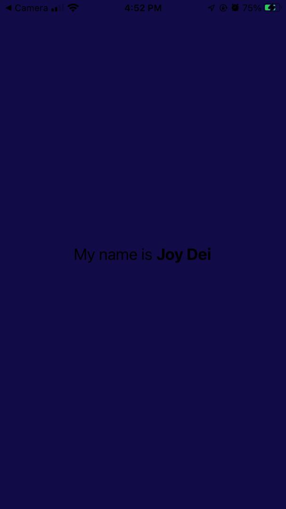

# React Native Assignment 2

This is a React Native project created for assignment 2. 

## Task Description

In this assignment, I created a new React Native blank template project using Expo CLI. Then, I made the following changes to the App.js file:
- Changed the background color of the View component to Dark blue.
- Edited the Text component to display "My name is Joy Dei".
- Increased the font size of the text to 24.
- Made the name "Joy Dei" bold.

## Screenshots

## Student ID

Student ID: 11165792